## Zoo in Telega
#### проект для Московского Зоопарка - развлекательный Телеграм бот для определения Вашего тотемного животного.

---

__Запуск проекта:__

Т.к. данный проект разрабатывался на ОС Windows 11, то все нижеприведённые инструкции
приведены для такой же ОС.

1. Выбираем/создаём директорию для проекта. Для этого можно использовать Git Bash:

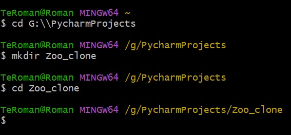

2. Клонируем проект из удалённого репозитория на GitHub с помощью команды:

    > ___git clone https://github.com/n0fl3x/MSK_zoo_bot.git___

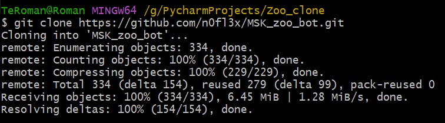

3. Открываем проект с помощью IDE (PyCharm, Visual Studio Code, и т.п.)

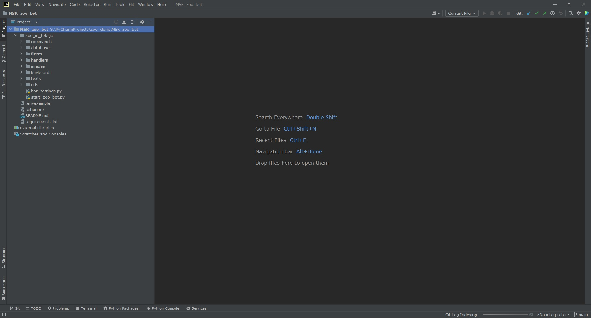

4. Открываем окно терминала и переходим (проверяем) в директорию проекта:

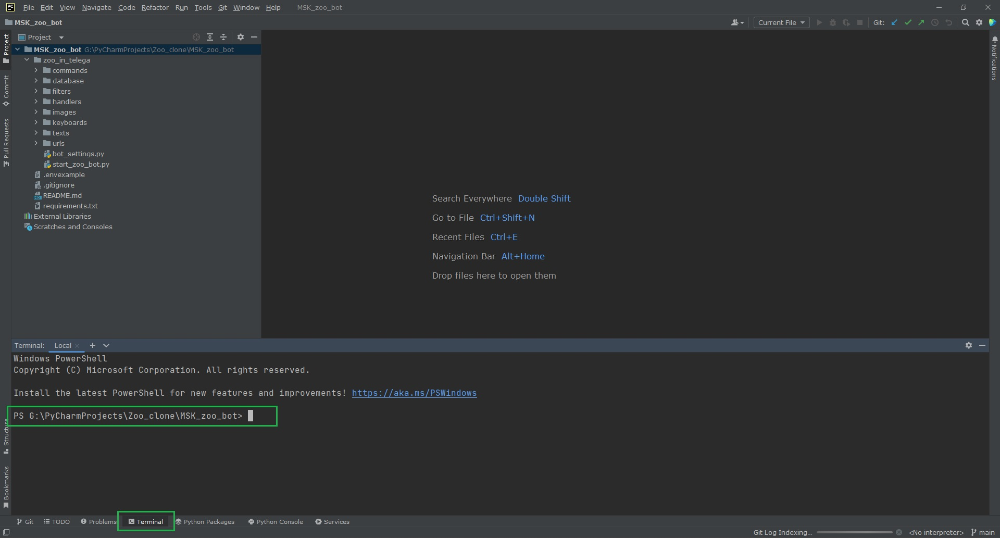

5. Создаём виртуальное окружение для проекта:

    > ___py -m venv venv___

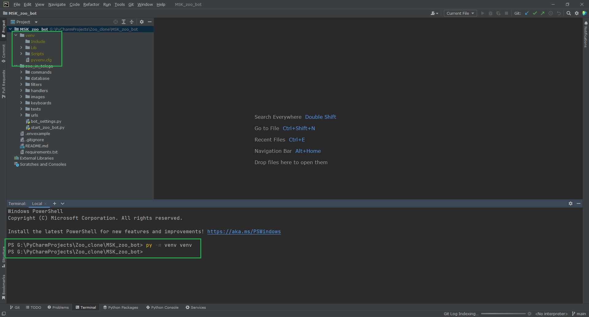

6. Активируем виртуальное окружение:

   > ___venv\scripts\activate___

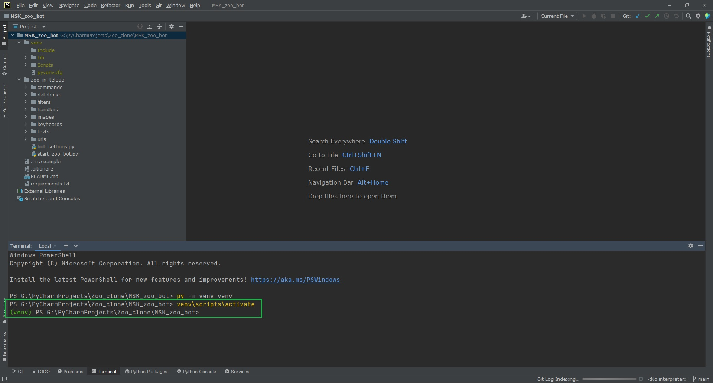

7. Устанавливаем необходимые для работы проекта зависимости
(на это уйдёт какое-то время, поэтому нужно будет немного подождать):

    > ___pip install -r requirements.txt___

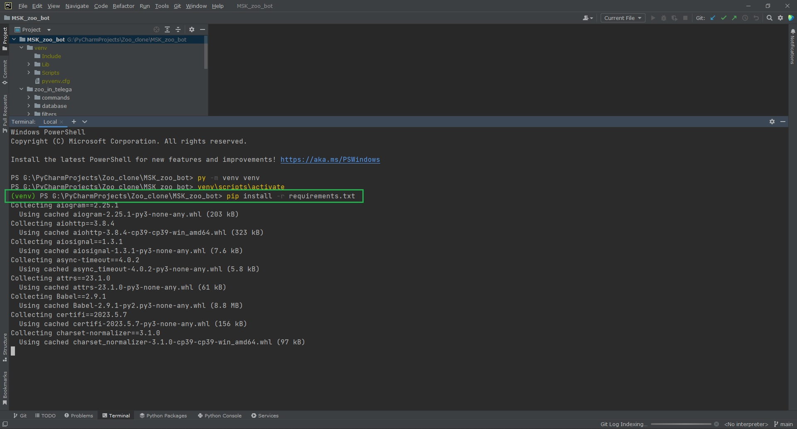
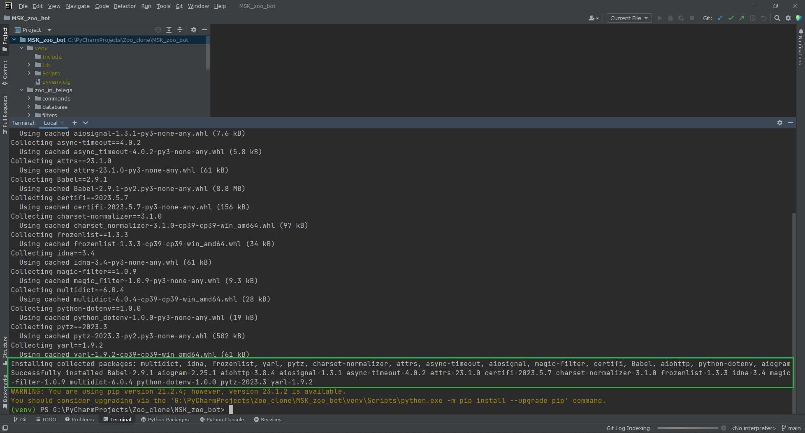

8. В директории проекта создаём файл .env, в котором необходимо указать данные
используемого Telegram токена. Для образца можно ипользовать файл .envexample:

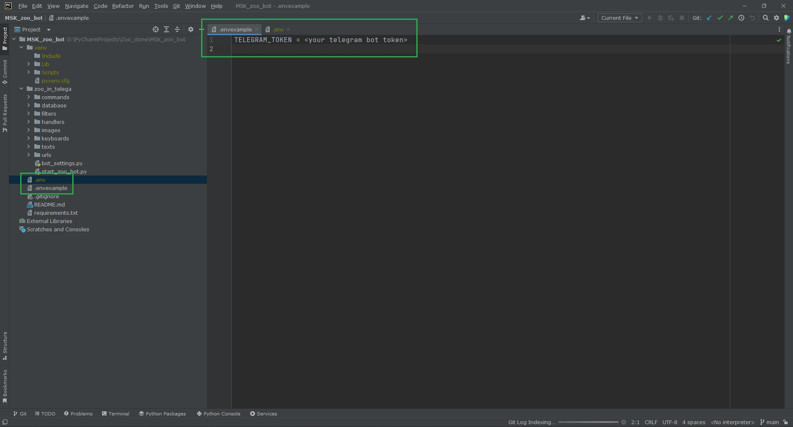

__Далее есть 2 способа запуска проекта:__

1. Запустить проект с помощью IDE. Для этого необходимо открыть файл
start_zoo_bot.py и запустить его:

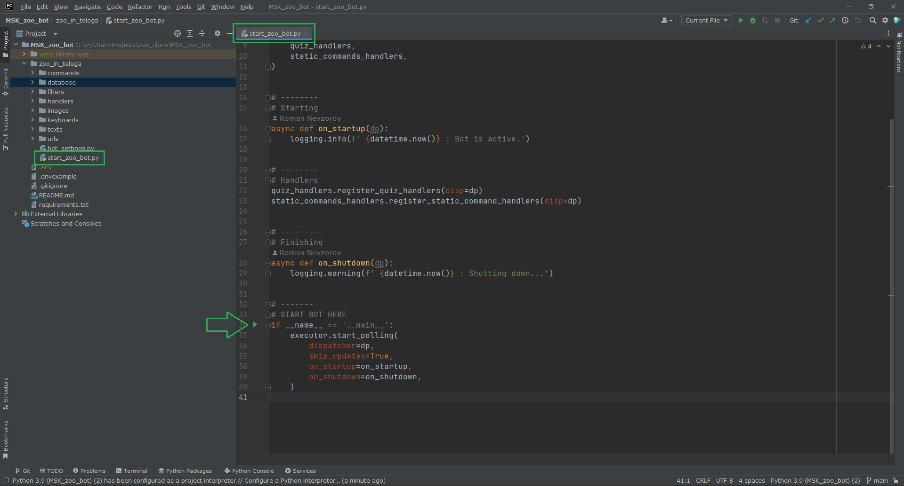
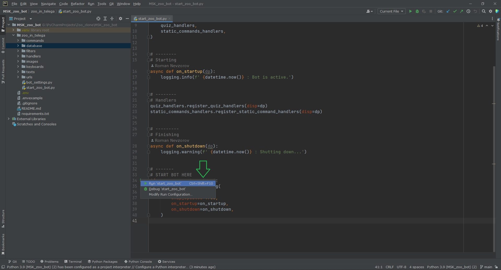
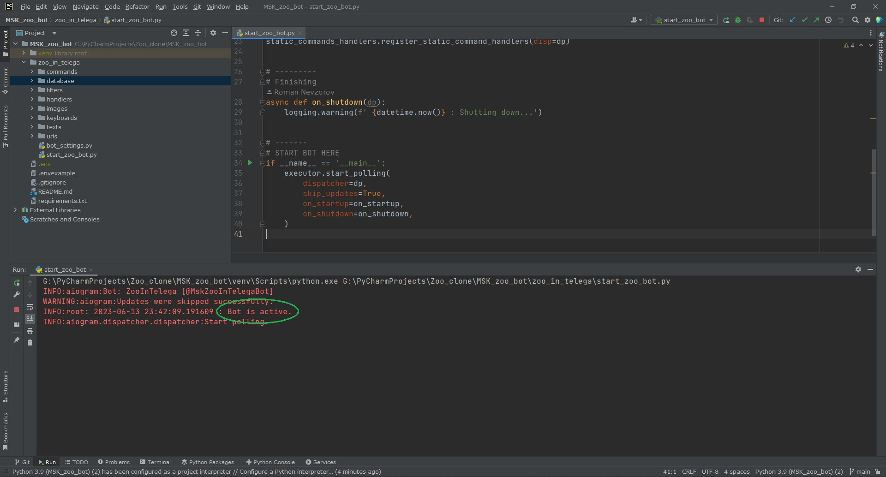

2. С помощью пакетного файла.
- Создать пакетный файл с расширением .bat, который можно запустить
двойным щелчком мышки без использования IDE. Для этого в директории проекта
необходимо создать файл с любым названием и расширением .bat (например run_bot.bat):

- Добавить в данный файл следующий код (не забудьте указать Ваш Телеграм токен!):

>@echo off
>
>call %~dp0venv\scripts\activate
> 
>cd %~dp0zoo_in_telega
> 
>set TELEGRAM_TOKEN = ЗДЕСЬ БУДЕТ ВАШ ТЕЛЕГРАМ ТОКЕН
> 
>python start_zoo_bot.py
> 
>pause

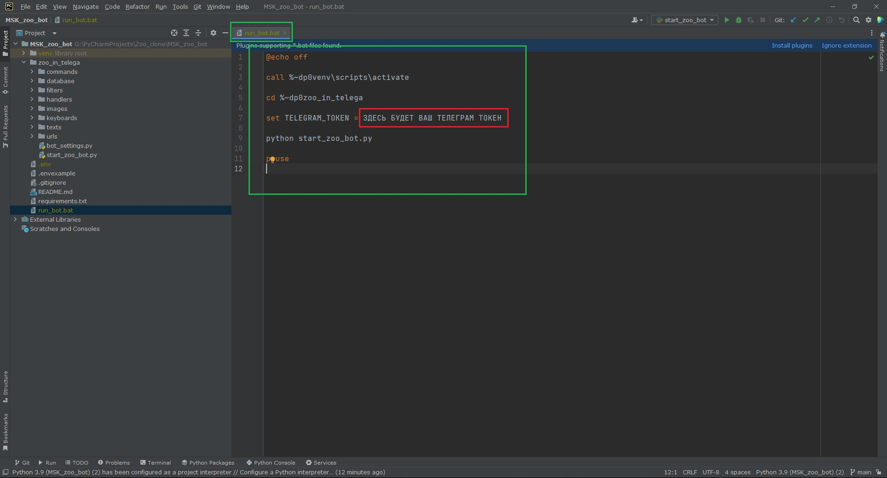

- Сохранить файл.

- Теперь можно просто запустить созданный в директории проекта файл:

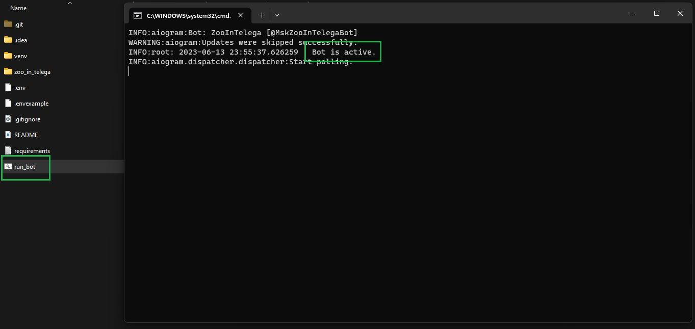
